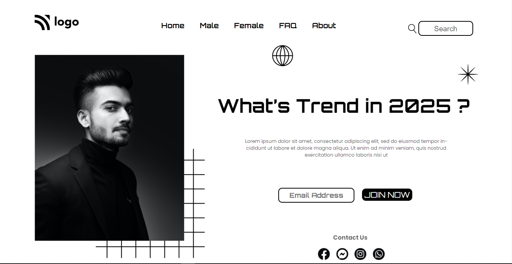

# Project-01/15 
It is a static home page made using **HTML & CSS**.

#### From this project, I've learned:-

1. How to design and style the navbar.
2. How to use the concept of position. (Position: Relative, absolute)
3. How to style different elements using css properties.

> ### The Screenshot of the site is attached below:-

- Time taken: 3 Hour 30 minutes

> ### The link to the site: [Street style Landing Page](https://aim-street-style-landing-page.netlify.app/)
